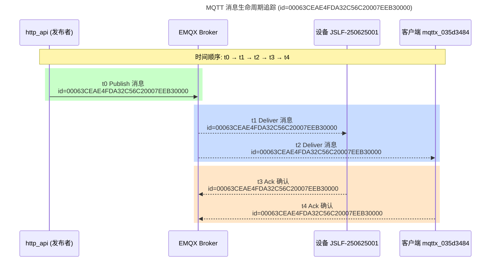
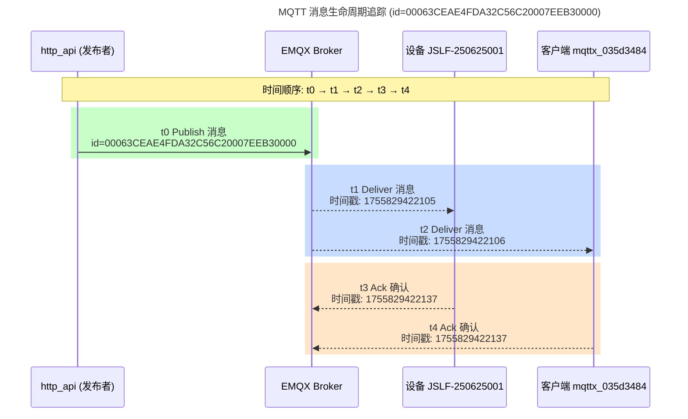

```mermaid
sequenceDiagram
    title MQTT 消息生命周期追踪 (id=00063CEAE4FDA32C56C20007EEB30000)

    participant API as http_api (发布者)
    participant EMQX as EMQX Broker
    participant DEV as 设备 JSLF-250625001
    participant CLI as 客户端 mqttx_035d3484

    %% 时间轴
    Note over API,CLI: 时间顺序: t0 → t1 → t2 → t3 → t4

    %% Publish 阶段（绿色）
    rect rgb(200,255,200)
        API->>EMQX: t0 Publish 消息<br/>id=00063CEAE4FDA32C56C20007EEB30000
    end

    %% Deliver 阶段（蓝色）
    rect rgb(200,220,255)
        EMQX-->>DEV: t1 Deliver 消息<br/>id=00063CEAE4FDA32C56C20007EEB30000
        EMQX-->>CLI: t2 Deliver 消息<br/>id=00063CEAE4FDA32C56C20007EEB30000
    end

    %% Ack 阶段（橙色）
    rect rgb(255,230,200)
        DEV-->>EMQX: t3 Ack 确认<br/>id=00063CEAE4FDA32C56C20007EEB30000
        CLI-->>EMQX: t4 Ack 确认<br/>id=00063CEAE4FDA32C56C20007EEB30000
    end

```

```mermaid
sequenceDiagram
    title MQTT 消息生命周期追踪 (id=00063CEAE4FDA32C56C20007EEB30000)

    participant API as http_api (发布者)
    participant EMQX as EMQX Broker
    participant DEV as 设备 JSLF-250625001
    participant CLI as 客户端 mqttx_035d3484

    %% 抽象时间轴
    Note over API,CLI: 时间顺序: t0 → t1 → t2 → t3 → t4

    %% Publish 阶段（绿色）
    rect rgb(200,255,200)
        API->>EMQX: t0 Publish 消息<br/>id=00063CEAE4FDA32C56C20007EEB30000
    end

    %% Deliver 阶段（蓝色）
    rect rgb(200,220,255)
        EMQX-->>DEV: t1 Deliver 消息<br/>时间戳: 1755829422105
        EMQX-->>CLI: t2 Deliver 消息<br/>时间戳: 1755829422106
    end

    %% Ack 阶段（橙色）
    rect rgb(255,230,200)
        DEV-->>EMQX: t3 Ack 确认<br/>时间戳: 1755829422137
        CLI-->>EMQX: t4 Ack 确认<br/>时间戳: 1755829422137
    end

```

