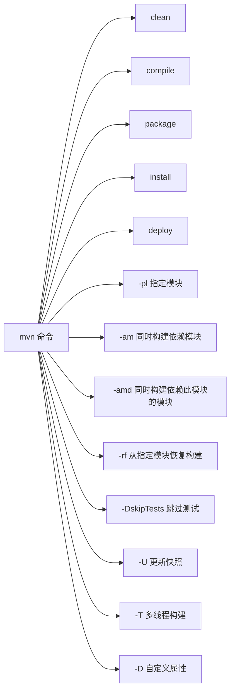
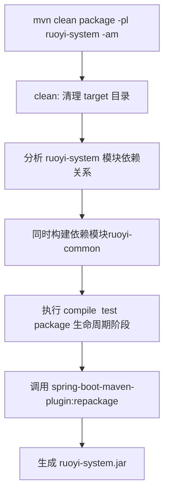
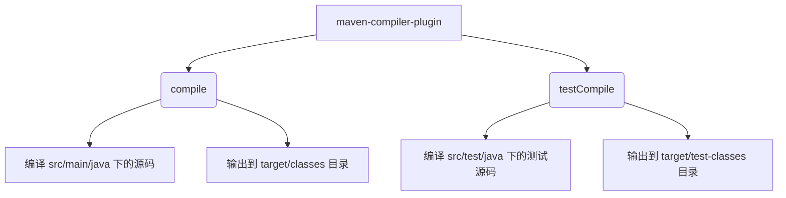

### 命令 mvn clean package -pl ruoyi-system -am





### package vs repackage

```mermaid
flowchart TB
  subgraph CLI["命令"]
    A[mvn package]
    B[mvn spring-bootrepackage]
  end
  
  A --> |执行到 package 阶段| PHASE[package lifecycle phase]

  PHASE --> |默认由| JAR[maven-jar-plugin:jar 或 maven-war-plugin:war]
  PHASE --> |若配置了 spring-boot 插件 execution | REPK[spring-boot-maven-plugin:repackage]

  B --> |显式调用 plugin goal | REPK

  note right of PHASE
    1) package 会触发 lifecycle 到 package。2) 若 spring-boot 的 repackage 被绑定到 package，则在 package 阶段会执行 repackage。
  end

```

### `maven-compiler-plugin` 的 goals




### `spring-boot-maven-plugin` 的 goals

```mermaid
graph TD
    A [spring-boot-maven-plugin] --> B(repackage)
    A --> C(run)
    A --> D(build-image)
    A --> E(start / stop)

    B --> B1[把已有 JAR 包重新打包为可执行 JAR]
    B --> B2[加入依赖和 Spring Boot Loader]

    C --> C1[直接运行 Spring Boot 应用]
    C --> C2[常用于开发调试]

    D --> D1[构建 OCI / Docker 镜像]
    D --> D2[集成 Cloud Native Buildpacks]

    E --> E1[启动 Spring Boot 应用（后台模式）]
    E --> E2[停止 Spring Boot 应用（后台模式）]

```

