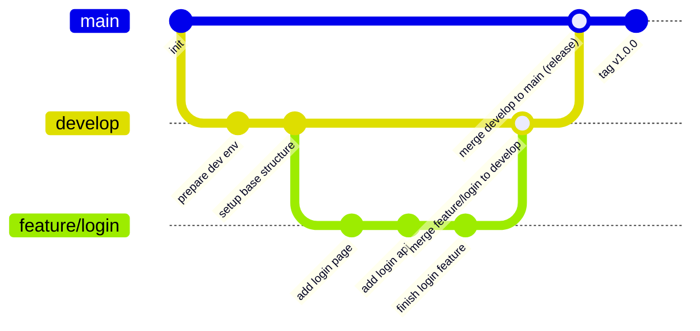
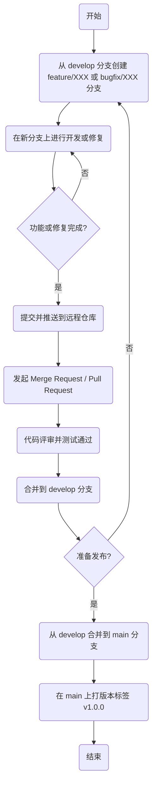
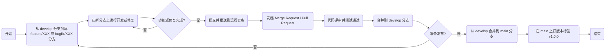
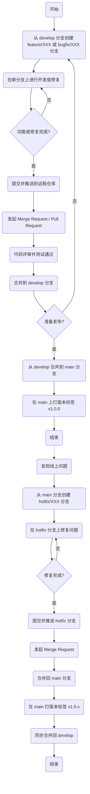

##### 分支管理


```mermaid
gitGraph
    commit id: "init"
    branch develop
    checkout develop
    commit id: "prepare dev env"
    commit id: "setup base structure"

    %% 创建功能分支
    branch feature/login
    checkout feature/login
    commit id: "add login page"
    commit id: "add login api"
    commit id: "finish login feature"

    %% 合并到 develop
    checkout develop
    merge feature/login id: "merge feature/login to develop"

    %% develop 测试稳定后合并到 main
    checkout main
    merge develop id: "merge develop to main (release)"
    commit id: "tag v1.0.0"

```

##### v2 垂直显示


```mermaid
flowchart TD
    A(开始)
    B(从 develop 分支创建 feature/XXX 或 bugfix/XXX 分支)
    C(在新分支上进行开发或修复)
    D{功能或修复完成?}
    E(提交并推送到远程仓库)
    F(发起 Merge Request / Pull Request)
    G(代码评审并测试通过)
    H(合并到 develop 分支)
    I{准备发布?}
    J(从 develop 合并到 main 分支)
    K(在 main 上打版本标签 v1.0.0)
    L(结束)

    A --> B --> C --> D
    D -->|否| C
    D -->|是| E --> F --> G --> H --> I
    I -->|否| B
    I -->|是| J --> K --> L

```

##### v3 水平显示


```mermaid
flowchart LR
    A(开始)
    B(从 develop 分支创建 feature/XXX 或 bugfix/XXX 分支)
    C(在新分支上进行开发或修复)
    D{功能或修复完成?}
    E(提交并推送到远程仓库)
    F(发起 Merge Request / Pull Request)
    G(代码评审并测试通过)
    H(合并到 develop 分支)
    I{准备发布?}
    J(从 develop 合并到 main 分支)
    K(在 main 上打版本标签 v1.0.0)
    L(结束)

    A --> B --> C --> D
    D -->|否| C
    D -->|是| E --> F --> G --> H --> I
    I -->|否| B
    I -->|是| J --> K --> L

```

##### v4 加上hotfix分支


```mermaid
flowchart TD
    A(开始)
    B(从 develop 分支创建 feature/XXX 或 bugfix/XXX 分支)
    C(在新分支上进行开发或修复)
    D{功能或修复完成?}
    E(提交并推送到远程仓库)
    F(发起 Merge Request / Pull Request)
    G(代码评审并测试通过)
    H(合并到 develop 分支)
    I{准备发布?}
    J(从 develop 合并到 main 分支)
    K(在 main 上打版本标签 v1.0.0)
    L(结束)

    %% hotfix 流程
    M(发现线上问题)
    N(从 main 分支创建 hotfix/XXX 分支)
    O(在 hotfix 分支上修复问题)
    P{修复完成?}
    Q(提交并推送 hotfix 分支)
    R(发起 Merge Request)
    S(合并回 main 分支)
    T(在 main 打版本标签 v1.0.x)
    U(同步合并回 develop)
    V(结束)

    %% 主流程
    A --> B --> C --> D
    D -->|否| C
    D -->|是| E --> F --> G --> H --> I
    I -->|否| B
    I -->|是| J --> K --> L

    %% hotfix 子流程
    L -.-> M --> N --> O --> P
    P -->|否| O
    P -->|是| Q --> R --> S --> T --> U --> V

```



```mermaid
flowchart LR
    A(开始)
    B(从 develop 分支创建 feature/XXX 或 bugfix/XXX 分支)
    C(在新分支上进行开发或修复)
    D{功能或修复完成?}
    E(提交并推送到远程仓库)
    F(发起 Merge Request / Pull Request)
    G(代码评审并测试通过)
    H(合并到 develop 分支)
    I{准备发布?}
    J(从 develop 合并到 main 分支)
    K(在 main 上打版本标签 v1.0.0)
    L(结束)

    %% hotfix 流程
    M(发现线上问题)
    N(从 main 分支创建 hotfix/XXX 分支)
    O(在 hotfix 分支上修复问题)
    P{修复完成?}
    Q(提交并推送 hotfix 分支)
    R(发起 Merge Request)
    S(合并回 main 分支)
    T(在 main 打版本标签 v1.0.x)
    U(同步合并回 develop)
    V(结束)

    %% 主流程
    A --> B --> C --> D
    D -->|否| C
    D -->|是| E --> F --> G --> H --> I
    I -->|否| B
    I -->|是| J --> K --> L

    %% hotfix 子流程
    L -.-> M --> N --> O --> P
    P -->|否| O
    P -->|是| Q --> R --> S --> T --> U --> V

```

```

```

