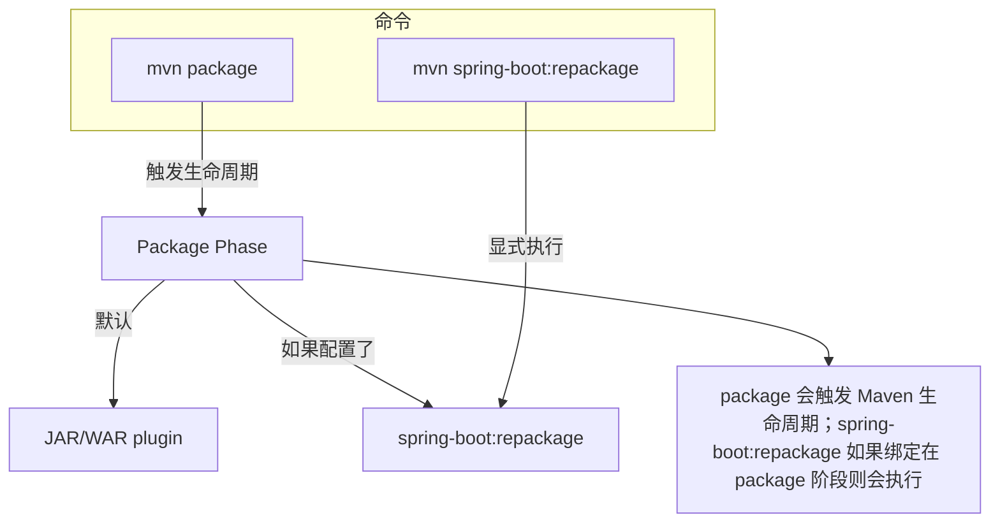
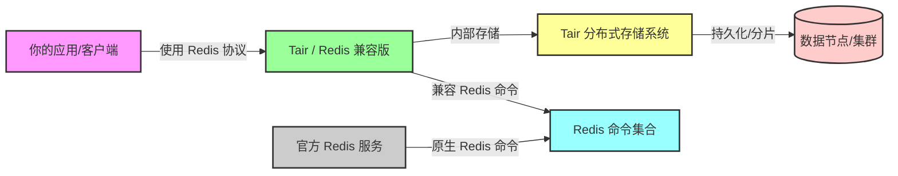

# 一级标题

## 二级标题

### 三级标题

#### 四级标题

# git 仓库初始化

``` bash
# 1. 进入你的目录
cd /path/to/mydir

# 2. 初始化 git 仓库
git init

# 3. 添加远程仓库（这里命名为 origin）
git remote add origin https://github.com/yourname/yourrepo.git

# 4. 添加当前目录所有文件
git add .

# 5. 提交
git commit -m "初始提交"

# 6. 推送到 GitHub main 分支（有的默认是 master）
git branch -M main
git push -u origin main

```

### package vs repackage



### **阿里云 Tair、Redis 协议、客户端** 的关系




