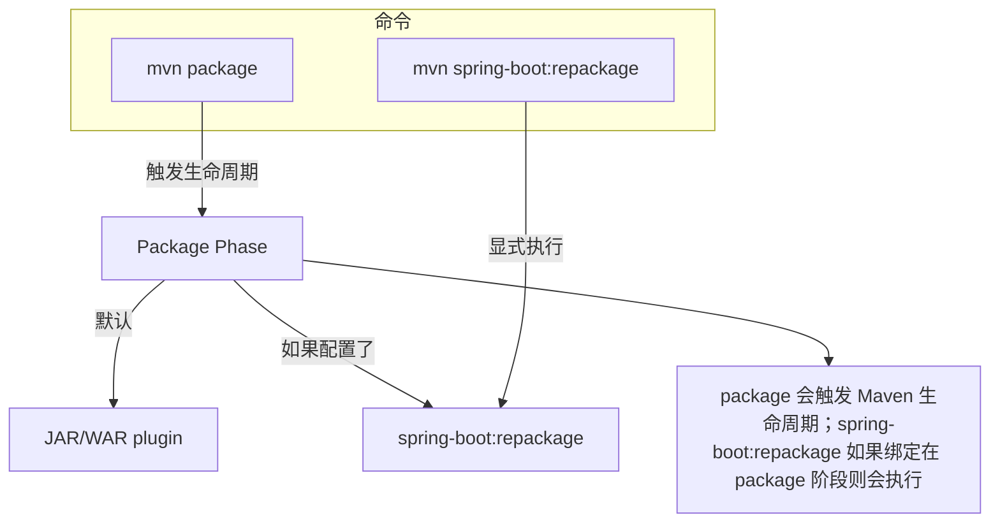
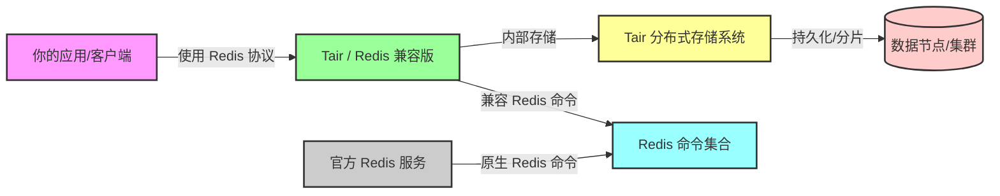
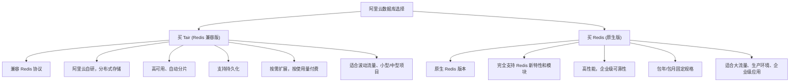
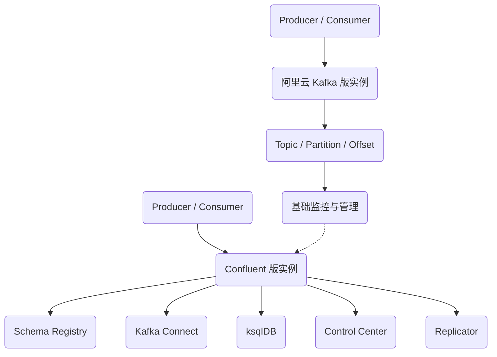
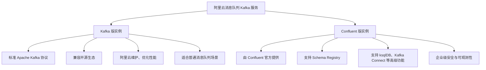

# 一级标题

## 二级标题

### 三级标题

#### 四级标题

# git 仓库初始化

``` bash
# 1. 进入你的目录
cd /path/to/mydir

# 2. 初始化 git 仓库
git init

# 3. 添加远程仓库（这里命名为 origin）
git remote add origin https://github.com/yourname/yourrepo.git

# 4. 添加当前目录所有文件
git add .

# 5. 提交
git commit -m "初始提交"

# 6. 推送到 GitHub main 分支（有的默认是 master）
git branch -M main
git push -u origin main

```

### package vs repackage



### **阿里云 Tair、Redis 协议、客户端** 的关系




### 简明版的“买 Tair vs 买 Redis 的区别图



| 对比项   | Tair (Redis 兼容版)                               | Redis 原生版                                            |
| -------- | ------------------------------------------------- | ------------------------------------------------------- |
| 协议兼容 | 支持 Redis 协议，客户端无需改动                   | 原生 Redis 协议                                         |
| 功能     | 支持大部分 Redis 命令，部分新特性或模块可能不支持 | 完全支持 Redis 新特性和模块（如 Streams、RedisJSON 等） |
| 内部架构 | 阿里云自研分布式存储，高可用、自动分片            | 官方 Redis 存储，单机或集群模式                         |
| 持久化   | 支持持久化                                        | 支持持久化                                              |
| 扩展能力 | 弹性扩展，按使用量付费                            | 固定规格（包年/包月），可手动扩容                       |
| 运维     | 云端全托管，免运维                                | 云端托管或自建集群，需运维能力                          |
| 适用场景 | 流量波动大、中小型项目、开发测试环境              | 稳定大流量、企业生产环境、低延迟、高性能应用            |
| 成本     | 按使用量付费，灵活                                | 固定费用，成本可预测                                    |

###  **阿里云 Kafka 版实例** 与 **Confluent 版实例** 的架构与生态差异



### Kafka 版 vs Confluent 版



| 对比项   | Kafka 版实例         | Confluent 版实例                 |
| -------- | -------------------- | -------------------------------- |
| 提供方   | 阿里云               | Confluent 官方                   |
| 协议兼容 | Apache Kafka         | Apache Kafka + 扩展功能          |
| 生态支持 | 基础 Kafka 客户端    | Schema Registry、ksqlDB、Connect |
| 使用场景 | 通用消息队列、日志流 | 企业级数据流平台、实时分析       |
| 成本     | 较低                 | 较高                             |
| 维护方   | 阿里云               | Confluent 官方（由阿里云托管）   |