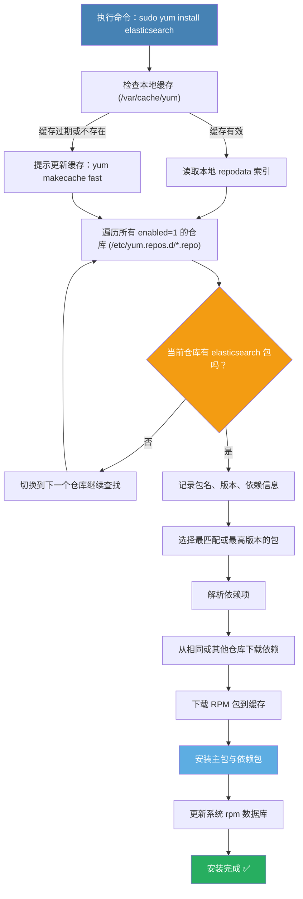
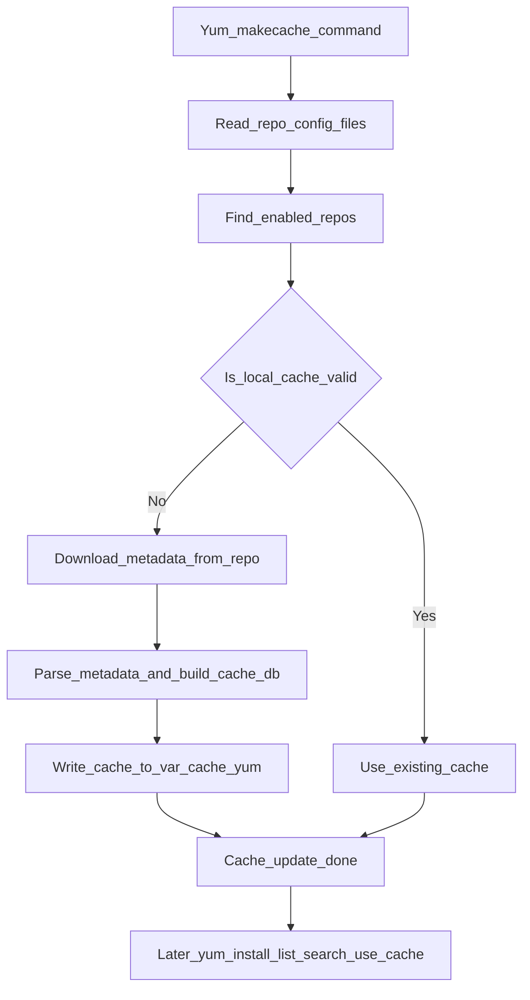

# Linux 操作系统安装软件

## YUM 安装软件包（以 `elasticsearch` 为例）时的完整流程图

```mermaid
flowchart TD
    A["执行命令：sudo yum install elasticsearch"] --> B["检查本地缓存 (/var/cache/yum)"]
    B -->|缓存有效| C["读取本地 repodata 索引"]
    B -->|缓存过期或不存在| D["提示更新缓存：yum makecache fast"]

    C --> E["遍历所有 enabled=1 的仓库 (/etc/yum.repos.d/*.repo)"]
    D --> E

    E --> F{"当前仓库有 elasticsearch 包吗？"}
    F -->|否| G["切换到下一个仓库继续查找"]
    F -->|是| H["记录包名、版本、依赖信息"]

    G --> E
    H --> I["选择最匹配或最高版本的包"]
    I --> J["解析依赖项"]
    J --> K["从相同或其他仓库下载依赖"]
    K --> L["下载 RPM 包到缓存"]
    L --> M["安装主包与依赖包"]
    M --> N["更新系统 rpm 数据库"]
    N --> O["安装完成 ✅"]

    %% Typora 兼容样式（仅 fill/color）
    style A fill:#4682B4,color:#fff
    style F fill:#f39c12,color:#fff
    style M fill:#5dade2,color:#fff
    style O fill:#27ae60,color:#fff

```

```mermaid
graph TD
    A[Yum_makecache_command] --> B[Read_repo_config_files]
    B --> C[Find_enabled_repos]
    C --> D{Is_local_cache_valid}
    D -->|Yes| E[Use_existing_cache]
    D -->|No| F[Download_metadata_from_repo]
    F --> G[Parse_metadata_and_build_cache_db]
    G --> H[Write_cache_to_var_cache_yum]
    H --> I[Cache_update_done]
    E --> I
    I --> J[Later_yum_install_list_search_use_cache]

```

