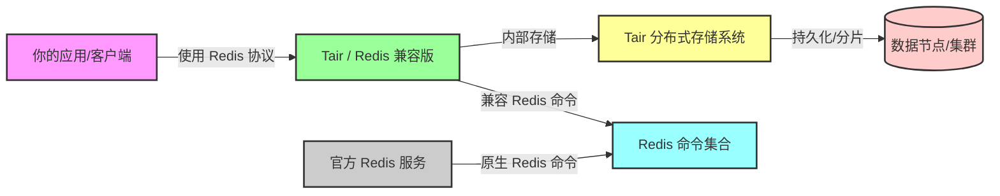

``````mermaid
graph TD
    A[ICP备案 / APP备案] --> B[网站备案]
    A --> C[APP备案]

    B --> B1[备案对象 域名 + 网站]
    B --> B2[法律依据 互联网信息服务管理办法]
    B --> B3[管理部门 工信部/通信管理局]
    B --> B4[适用场景 在中国大陆提供网站服务]
    B --> B5[必须条件 使用大陆服务器 + 域名指向]

    C --> C1[备案对象 移动应用 Android/iOS]
    C --> C2[法律依据 移动互联网应用程序信息服务管理规定]
    C --> C3[管理部门 工信部/通信管理局 + 应用商店]
    C --> C4[适用场景 在中国大陆提供下载或运营的APP]
    C --> C5[必须条件 上架国内应用商店]

    B:::webStyle
    C:::appStyle

    classDef webStyle fill:#cce5ff,stroke:#003366,stroke-width:2px;
    classDef appStyle fill:#d4edda,stroke:#155724,stroke-width:2px;
``````

```mermaid
sequenceDiagram
    participant Browser as 浏览器(客户端)
    participant Server as 服务器
    participant CA as CA根证书(已内置在浏览器)

    Browser->>Server: 请求建立HTTPS连接 (ClientHello)
    Server-->>Browser: 返回证书 (含域名、公钥、签名、颁发者)

    Browser->>CA: 验证证书签名(证书链)
    CA-->>Browser: 验证通过/失败

    Browser->>Browser: 检查域名是否匹配证书CN/SAN
    Browser->>Browser: 检查有效期
    Browser->>Browser: 检查吊销状态 (CRL/OCSP)

    alt 验证通过
        Browser->>Server: 用证书公钥加密会话密钥并发送
        Server->>Server: 用私钥解密会话密钥
        Browser<->Server: 使用对称密钥加密通信
    else 验证失败
        Browser->>User: 显示证书错误(⚠️ 不安全)
    end

```



