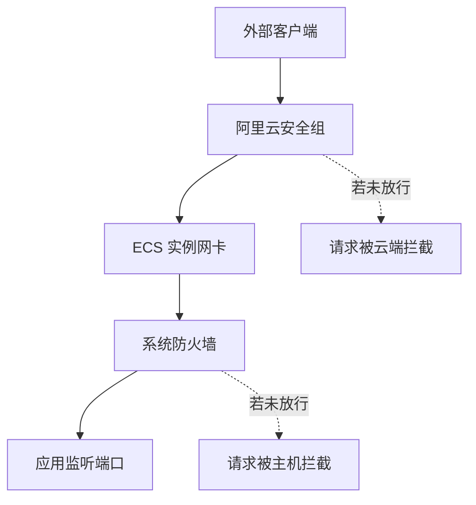
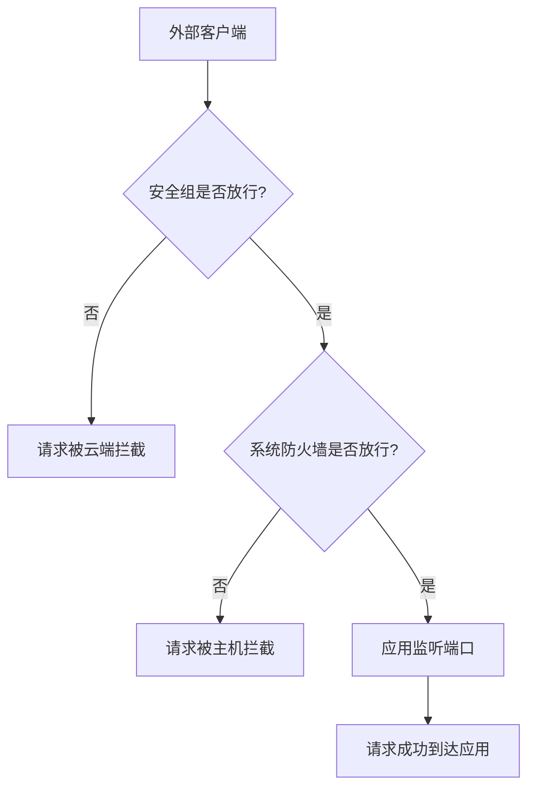

### 阿里云 安全组与防火墙的流量路径示意图

##### 说明

### 图解说明

1. **外部客户端 → 安全组**
   - 若安全组没开放端口，直接被云端丢弃。
   - 若安全组放行 → 继续进入 ECS。
2. **系统防火墙（firewalld/iptables）**
   - 若防火墙没开放端口 → 系统拒绝连接。
   - 若防火墙放行 → 到达应用层。
3. **应用监听端口**
   - 程序监听成功，访问正常返回。

###  最终结果判断

✅ **安全组通过 + 防火墙通过 + 应用监听**
 → 外部访问成功
 ❌ 任一环节失败
 → 请求被拦截

