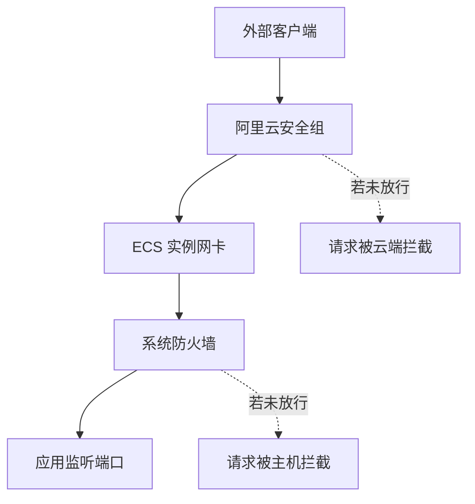
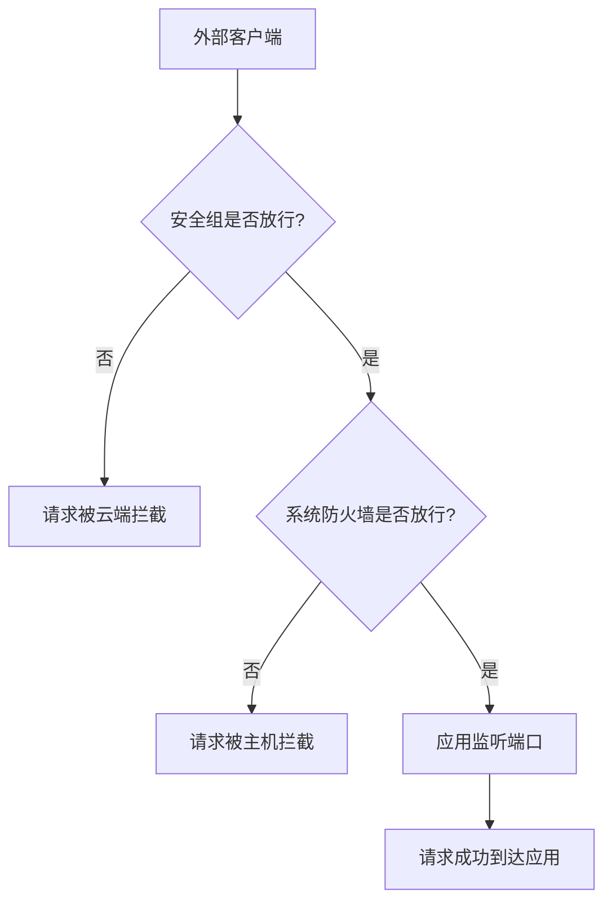
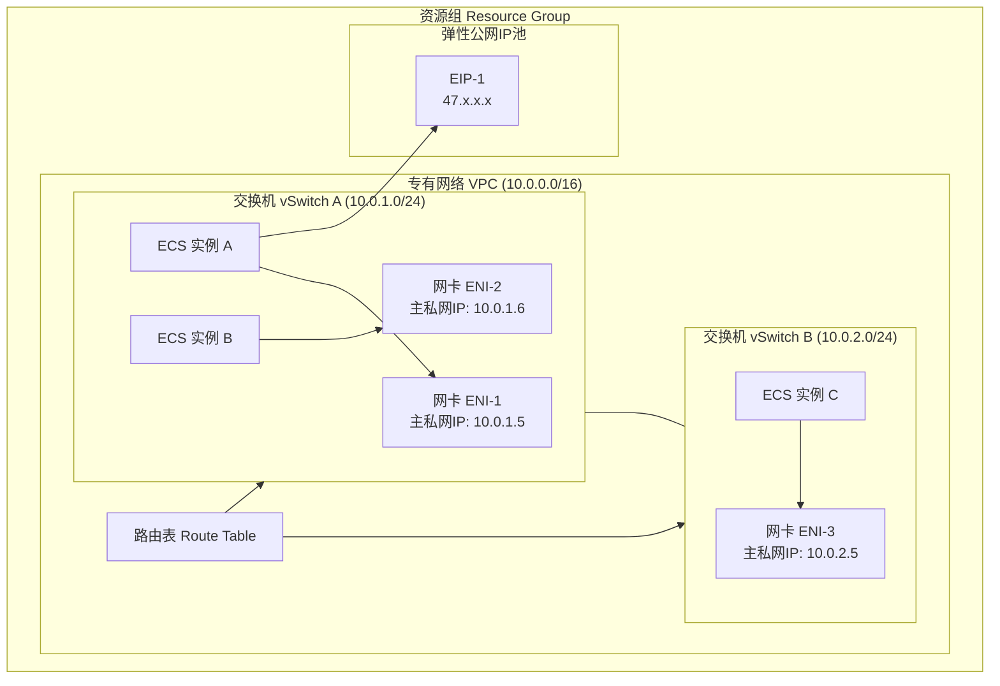
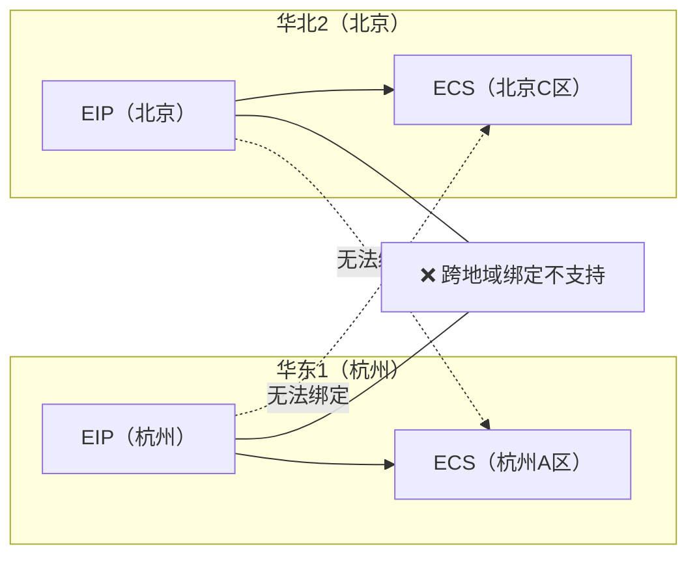
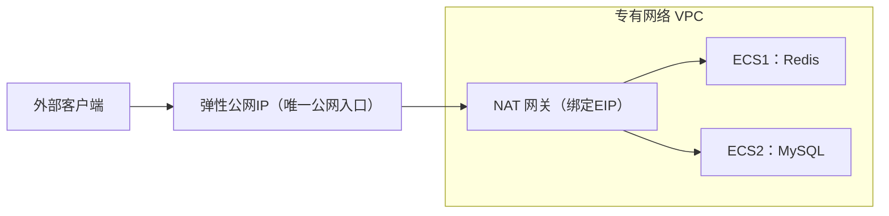
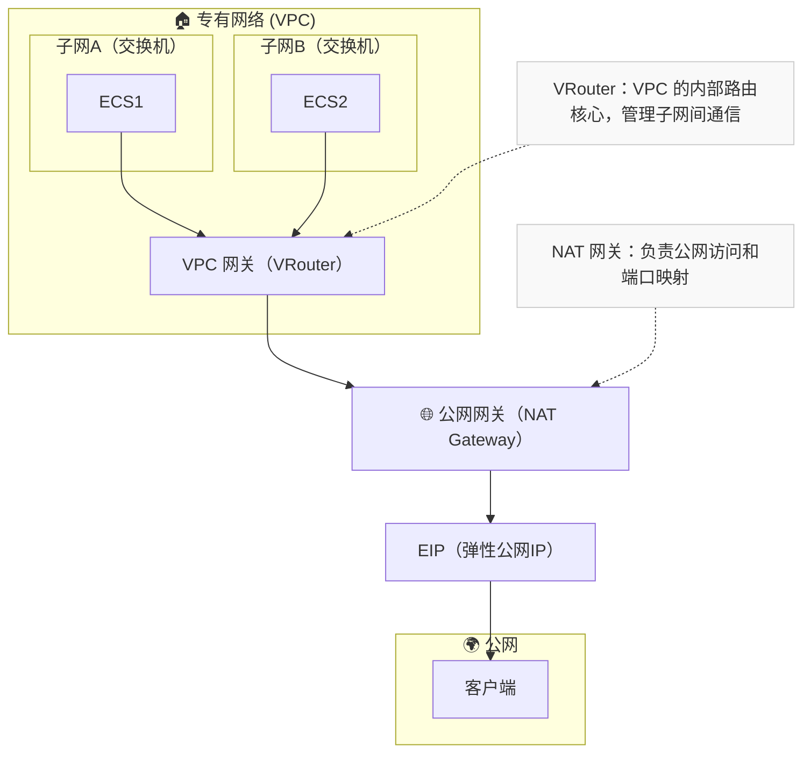
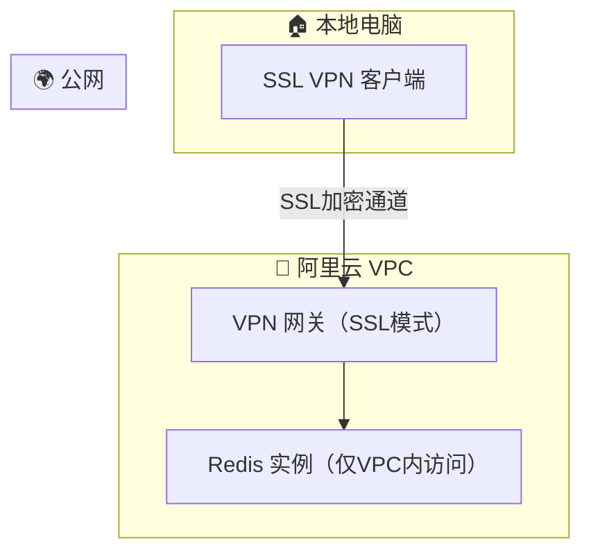

### 阿里云 安全组与防火墙的流量路径示意图

##### 说明

### 图解说明

1. **外部客户端 → 安全组**
   - 若安全组没开放端口，直接被云端丢弃。
   - 若安全组放行 → 继续进入 ECS。
2. **系统防火墙（firewalld/iptables）**
   - 若防火墙没开放端口 → 系统拒绝连接。
   - 若防火墙放行 → 到达应用层。
3. **应用监听端口**
   - 程序监听成功，访问正常返回。

###  最终结果判断

✅ **安全组通过 + 防火墙通过 + 应用监听**
 → 外部访问成功
 ❌ 任一环节失败
 → 请求被拦截





### 阿里云网络资源图谱



##### 弹性公网IP 绑定关系说明图谱





##### 公网网关" 和 "VPC 网关



##### SSL VPN 网关接入 VPC



##### 挂载云盘 手动操作 

```bash
## 非核心服务器
[root@iZ2ze8q9293ytn6mlia8fuZ ~]# mkdir -p /mnt/vdb1
[root@iZ2ze8q9293ytn6mlia8fuZ ~]# mount /dev/vdb1 /mnt/vdb1
[root@iZ2ze8q9293ytn6mlia8fuZ ~]# df -h
文件系统        容量  已用  可用 已用% 挂载点
devtmpfs         16G     0   16G    0% /dev
tmpfs            16G     0   16G    0% /dev/shm
tmpfs            16G  576K   16G    1% /run
tmpfs            16G     0   16G    0% /sys/fs/cgroup
/dev/vda1        99G  6.9G   88G    8% /
tmpfs           3.1G     0  3.1G    0% /run/user/0
/dev/vdb1       493G   73M  467G    1% /mnt/vdb1
[root@iZ2ze8q9293ytn6mlia8fuZ ~]# blkid /dev/vdb1
/dev/vdb1: UUID="03c448bd-1c38-47eb-98dd-b855c92eb46d" TYPE="ext4" PARTLABEL="Linux" PARTUUID="cf33f9bd-3891-4aea-a627-1a3a95397ce6" 
[root@iZ2ze8q9293ytn6mlia8fuZ ~]# vi /etc/fstab
[root@iZ2ze8q9293ytn6mlia8fuZ ~]# vi /etc/fstab
[root@iZ2ze8q9293ytn6mlia8fuZ ~]# cat /etc/fastab
cat: /etc/fastab: 没有那个文件或目录
[root@iZ2ze8q9293ytn6mlia8fuZ ~]# cat /etc/fstab

#
# /etc/fstab
# Created by anaconda on Fri Jun 28 04:16:23 2024
#
# Accessible filesystems, by reference, are maintained under '/dev/disk'
# See man pages fstab(5), findfs(8), mount(8) and/or blkid(8) for more info
#
UUID=c8b5b2da-5565-4dc1-b002-2a8b07573e22 /                       ext4    defaults        1 1
UUID=03c448bd-1c38-47eb-98dd-b855c92eb46d /mnt/vdb1 ext4 defaults,nofail 0 2


## 中间件服务器
[root@iZ2ze8d2ahedv4d36gi3feZ ~]# mkdir -p /mnt/vdb1
[root@iZ2ze8d2ahedv4d36gi3feZ ~]# mount /dev/vdb1 /mnt/vdb1
[root@iZ2ze8d2ahedv4d36gi3feZ ~]# df -h
文件系统        容量  已用  可用 已用% 挂载点
devtmpfs         16G     0   16G    0% /dev
tmpfs            16G     0   16G    0% /dev/shm
tmpfs            16G  580K   16G    1% /run
tmpfs            16G     0   16G    0% /sys/fs/cgroup
/dev/vda1        99G  4.1G   91G    5% /
tmpfs           3.1G     0  3.1G    0% /run/user/0
/dev/vdb1       493G   73M  467G    1% /mnt/vdb1
[root@iZ2ze8d2ahedv4d36gi3feZ ~]# blkid /dev/vdb1
/dev/vdb1: UUID="77e32567-3860-42f7-9051-087a4ed4cd61" TYPE="ext4" PARTLABEL="Linux" PARTUUID="f639c9ea-ef2d-477d-9666-c21d2fc99005" 
[root@iZ2ze8d2ahedv4d36gi3feZ ~]# ^C
[root@iZ2ze8d2ahedv4d36gi3feZ ~]# ^C
[root@iZ2ze8d2ahedv4d36gi3feZ ~]# vi /etc/fstab
[root@iZ2ze8d2ahedv4d36gi3feZ ~]# cat /etc/fstab

#
# /etc/fstab
# Created by anaconda on Fri Jun 28 04:16:23 2024
#
# Accessible filesystems, by reference, are maintained under '/dev/disk'
# See man pages fstab(5), findfs(8), mount(8) and/or blkid(8) for more info
#
UUID=c8b5b2da-5565-4dc1-b002-2a8b07573e22 /                       ext4    defaults        1 1
UUID=03c448bd-1c38-47eb-98dd-b855c92eb46d /mnt/vdb1 ext4 defaults,nofail 0 2
[root@iZ2ze8d2ahedv4d36gi3feZ ~]# vi /etc/fstab
[root@iZ2ze8d2ahedv4d36gi3feZ ~]# blkid /dev/vdb1
/dev/vdb1: UUID="77e32567-3860-42f7-9051-087a4ed4cd61" TYPE="ext4" PARTLABEL="Linux" PARTUUID="f639c9ea-ef2d-477d-9666-c21d2fc99005" 
[root@iZ2ze8d2ahedv4d36gi3feZ ~]# vi /etc/fstab
[root@iZ2ze8d2ahedv4d36gi3feZ ~]# 
连接断开
连接主机...
连接主机成功
Last login: Mon Oct 20 12:06:15 2025 from 113.132.210.120

Welcome to Alibaba Cloud Elastic Compute Service !

[root@iZ2ze8d2ahedv4d36gi3feZ ~]# cat /etc/fstab

#
# /etc/fstab
# Created by anaconda on Fri Jun 28 04:16:23 2024
#
# Accessible filesystems, by reference, are maintained under '/dev/disk'
# See man pages fstab(5), findfs(8), mount(8) and/or blkid(8) for more info
#
UUID=c8b5b2da-5565-4dc1-b002-2a8b07573e22 /                       ext4    defaults        1 1
UUID=77e32567-3860-42f7-9051-087a4ed4cd61 /mnt/vdb1 ext4 defaults,nofail 0 2
[root@iZ2ze8d2ahedv4d36gi3feZ ~]# 


```

